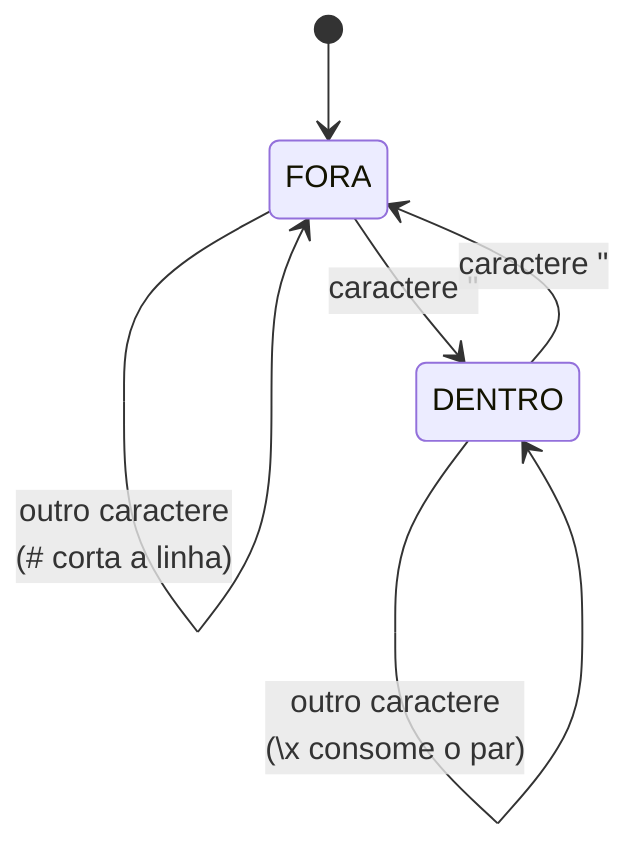
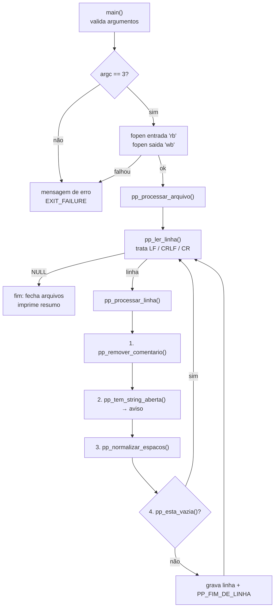

# Como o pré-processador funciona (por dentro)

Documento para o grupo entender **cada linha do código** e conseguir explicar o
trabalho na apresentação. Leia o [README.md](../README.md) primeiro, se ainda não leu.

---

## 1. A ideia central: um autômato de dois estados

Quase todo o trabalho se resume a uma única pergunta, feita **caractere por
caractere**:

> Eu estou **dentro** ou **fora** de uma string?

A resposta muda completamente o que fazer:

| Situação | `#` | espaços e tabs |
|---|---|---|
| **FORA** de string | inicia comentário → corta a linha | normaliza |
| **DENTRO** de string | é conteúdo → mantém | mantém exatamente |

Isso é literalmente um **autômato finito determinístico** de dois estados — o
assunto da disciplina aplicado ao próprio trabalho:



Em C, esse autômato vira **uma variável**:

```c
int dentro_string = 0;   /* 0 = estado FORA,  1 = estado DENTRO */
```

As funções `pp_remover_comentario()`, `pp_normalizar_espacos()` e
`pp_tem_string_aberta()` são **o mesmo autômato** com ações diferentes.
Entendeu um, entendeu os três.

---

## 2. Fluxo completo do programa



**A ordem das quatro etapas importa** e está comentada em
`pp_processar_linha()`:

1. **Comentário primeiro** — não faz sentido normalizar espaços de um texto que
   vai ser descartado.
2. **Aviso de string aberta depois do corte** — senão uma aspas que estava
   *dentro de um comentário* geraria aviso falso.
3. **Espaços depois** — trabalha sobre a linha já limpa.
4. **Linha vazia por último** — uma linha que só tinha comentário só fica vazia
   *depois* das etapas 1 e 3.

---

## 3. Função por função

### 3.1 `pp_ler_linha()` — normaliza as quebras de linha (seção 2.5)

**Problema:** o mesmo arquivo pode ter três terminadores diferentes, dependendo
de onde foi criado.

| Sistema | Bytes no fim da linha |
|---|---|
| Unix / macOS moderno | `\n` (LF) |
| Windows | `\r\n` (CRLF) |
| Mac OS clássico | `\r` (CR) |

**Solução:** lemos byte a byte e paramos nos três casos. O truque está no `\r`:

```c
if (c == '\r') {
    int proximo = fgetc(entrada);
    if (proximo != '\n' && proximo != EOF) {
        ungetc(proximo, entrada);   /* era CR sozinho: devolve o byte lido */
    }
    break;
}
```

Espiamos o próximo byte. Se for `\n`, era CRLF e consumimos os dois. Se não for,
era um CR sozinho e **devolvemos o byte** com `ungetc()` para não perdê-lo.

O terminador **nunca** entra na string devolvida. Quem grava a saída escolhe o
terminador (`PP_FIM_DE_LINHA`) — é assim que garantimos a uniformidade exigida.

**Buffer que cresce sozinho.** Começa com 128 bytes e dobra sempre que enche:

```c
if (tamanho + 1 >= capacidade) {   /* +1 reserva espaço para o '\0' */
    capacidade *= 2;
    novo = realloc(linha, capacidade);
    ...
}
```

Não existe limite de tamanho de linha. Usamos `realloc()` num ponteiro
temporário (`novo`) porque, se ele falhar, o ponteiro original ainda é válido e
conseguimos liberar a memória sem vazamento.

**Detalhe importante:** um arquivo que termina com `\n` **não** gera uma linha
vazia extra. Isso é garantido pelo teste final:

```c
if (c == EOF && tamanho == 0) { free(linha); return NULL; }
```

---

### 3.2 `pp_remover_comentario()` — seção 2.2

Percorre a linha com o autômato. Ao encontrar `#` **fora** de string, escreve
`'\0'` naquela posição — a linha simplesmente **acaba ali**. Não precisa copiar
nada.

```c
} else {                                  /* estado FORA */
    if (linha[i] == PP_ASPAS) {
        dentro_string = 1;
    } else if (linha[i] == PP_CARACTERE_COMENTARIO) {
        linha[i] = '\0';                  /* corta aqui */
        return 1;
    }
}
```

Casos cobertos pelo teste `01_comentarios`:

| Entrada | Saída | Por quê |
|---|---|---|
| `add $t0, $t1, $t2  # soma` | `add $t0, $t1, $t2  ` | `#` fora de string |
| `msg: .asciiz "Valor # 1"` | *(inalterada)* | `#` dentro de string |
| `# linha inteira` | *(vazia)* | corta na posição 0 |
| `li $t3, 10#colado` | `li $t3, 10` | não precisa de espaço antes do `#` |

Os espaços que sobram no fim (`...$t2  `) são retirados na etapa seguinte.

---

### 3.3 `pp_normalizar_espacos()` — seções 2.4 e 2.8

A função mais interessante do trabalho. Usa a técnica dos **dois índices**
(*two pointers*), que reescreve a string **dentro dela mesma**, sem memória extra:

- `leitura` — a posição que estamos lendo;
- `escrita` — a posição onde vamos gravar (**nunca passa de `leitura`**, por isso
  é seguro).

O truque que resolve as três exigências de uma vez é a variável
`espaco_pendente`: em vez de copiar o branco na hora, apenas **anotamos que ele
existiu**. O espaço só é gravado **imediatamente antes do próximo caractere
útil**. Consequências automáticas:

| Exigência | Por que acontece sozinho |
|---|---|
| Remover espaços do **início** | `espaco_pendente` só é marcado se `escrita > 0` |
| Remover espaços do **fim** | nunca vem um caractere útil depois para disparar a gravação |
| Reduzir vários espaços a **um** | várias marcações produzem um único `' '` |

#### Simulação passo a passo

Entrada: `␣␣add⇥$t0␣` (`␣` = espaço, `⇥` = tab)

| Passo | `leitura` | Caractere | Estado | Ação | Buffer (`escrita`) |
|---|---|---|---|---|---|
| 1 | 0 | `␣` | FORA | `escrita==0` → ignora | `` (0) |
| 2 | 1 | `␣` | FORA | `escrita==0` → ignora | `` (0) |
| 3 | 2 | `a` | FORA | grava | `a` (1) |
| 4 | 3 | `d` | FORA | grava | `ad` (2) |
| 5 | 4 | `d` | FORA | grava | `add` (3) |
| 6 | 5 | `⇥` | FORA | marca `espaco_pendente` | `add` (3) |
| 7 | 6 | `$` | FORA | grava `' '` pendente, depois `$` | `add $` (5) |
| 8 | 7 | `t` | FORA | grava | `add $t` (6) |
| 9 | 8 | `0` | FORA | grava | `add $t0` (7) |
| 10 | 9 | `␣` | FORA | marca `espaco_pendente` | `add $t0` (7) |
| — | fim | — | — | pendência **descartada**, escreve `'\0'` | `add $t0` |

Resultado: `add $t0`. Início, fim e o tab resolvidos numa única passada.

#### O ramo "dentro da string"

```c
if (dentro_string) {
    char atual = linha[leitura];
    linha[escrita++] = atual;   /* cópia fiel, sem tocar em nada */
    leitura++;
    if (atual == PP_ESCAPE && linha[leitura] != '\0') {
        linha[escrita++] = linha[leitura++];   /* copia o par \x inteiro */
        continue;
    }
    if (atual == PP_ASPAS) { dentro_string = 0; }
    continue;
}
```

Aqui **nada** é normalizado: espaços múltiplos, tabs e `#` são copiados como
estão. É isso que garante que `"A     B"` continue diferente de `"A B"`, como o
Manual da Linguagem exige (seção 6).

O tratamento do `PP_ESCAPE` (`\`) faz com que `\"` **não** feche a string —
sem isso, `"ele disse \"ola\""` seria interpretado como duas strings e o resto
da linha viraria comentário por engano.

---

### 3.4 `pp_esta_vazia()` — seção 2.3

Chamada **por último**. Se sobrou algum caractere que não seja branco, a linha
tem conteúdo e vai para o arquivo:

```c
while (linha[i] != '\0') {
    if (!pp_eh_branco(linha[i])) return 0;   /* achou conteúdo */
    i++;
}
return 1;
```

Uma linha que continha só `# comentário` chega aqui já vazia — e é descartada.

---

### 3.5 `pp_eh_branco()` — por que não usar `isspace()`

`isspace()` recebe um `int` e tem **comportamento indefinido** para valores
negativos. Em UTF-8, o `ç` de `"operação"` ocupa os bytes `0xC3 0xA7`, que num
`char` com sinal viram **números negativos**. Passar isso para `isspace()` é
tecnicamente um bug — que pode nunca aparecer na sua máquina e aparecer na do
professor.

Nossa versão compara os caracteres diretamente e nunca corre esse risco:

```c
int pp_eh_branco(char c)
{
    return (c == ' ' || c == '\t' || c == '\v' || c == '\f');
}
```

`\n` e `\r` não estão na lista porque `pp_ler_linha()` já os removeu.

---

### 3.6 `pp_remover_bom()`

O Bloco de Notas do Windows salva arquivos UTF-8 começando com os bytes
`EF BB BF` (*Byte Order Mark*). Eles são **invisíveis no editor**, mas para o
nosso programa fazem parte da primeira linha: em vez de `.data`, o lexer
receberia `<EF><BB><BF>.data` e não reconheceria a diretiva.

Removemos deslocando o resto da linha três bytes para a esquerda, só na
**primeira linha do arquivo** (é o único lugar onde o BOM pode aparecer).

---

## 4. Tratamento de erros

| Situação | Detectada em | Comportamento |
|---|---|---|
| Argumentos a mais / a menos | `main()` | mensagem + modo de uso + `EXIT_FAILURE` |
| Entrada não existe / sem permissão | `main()` | mensagem com o nome do arquivo |
| Saída não pode ser criada | `main()` | mensagem + fecha a entrada antes de sair |
| Entrada e saída com o mesmo nome | `main()` | recusa **antes** de abrir (senão apagaria o fonte) |
| Falta de memória | `pp_ler_linha()` | `PP_ERRO_MEMORIA` sobe até `main()` |
| Falha de leitura/escrita | `pp_processar_arquivo()` | `ferror()` + código de erro |
| String sem fechamento | `pp_processar_linha()` | **aviso** em `stderr`, processamento **continua** |

Três princípios que valem a pena defender na apresentação:

1. **Nenhum recurso vaza.** Todo `fopen()` tem seu `fclose()` em qualquer
   caminho de saída; todo `malloc()` tem seu `free()`.
2. **Nenhum arquivo pela metade.** Se der erro no meio, `main()` chama
   `remove()` e apaga o `.pre` incompleto — assim ninguém entrega para a próxima
   etapa um arquivo truncado achando que está bom.
3. **Aviso ≠ erro.** A seção 2.10 proíbe validar sintaxe. Por isso a string
   aberta gera aviso e o programa termina com sucesso.

---

## 5. Como testar uma função isolada

Toda função trabalha sobre um `char *` comum, então dá para testar sem arquivo
nenhum. Útil se o grupo quiser investigar um caso específico:

```c
#include <stdio.h>
#include "preprocessador.h"

int main(void)
{
    char linha[] = "    add\t$t0,   $t1     # soma";

    pp_remover_comentario(linha);
    pp_normalizar_espacos(linha);

    printf("[%s]\n", linha);     /* [add $t0, $t1] */
    return 0;
}
```

Compile com `gcc teste_rapido.c preprocessador.c -o teste_rapido`.

> Use `char linha[] = "..."` (vetor), **não** `char *linha = "..."` (ponteiro
> para literal). As funções modificam a string no próprio lugar, e escrever num
> literal é comportamento indefinido — costuma dar *segmentation fault*.

---

## 6. Armadilhas que já estão resolvidas no código

Se alguém do grupo for reescrever alguma parte, cuidado com estas:

1. **Cortar o `#` antes de saber se está dentro de uma string.** Quebra
   `.asciiz "Resultado # obtido"`. É o erro mais comum nesse trabalho.
2. **Usar `strtok()` ou `sscanf("%s")` para separar tokens.** Eles quebram a
   string nos espaços — inclusive nos espaços **dentro** das aspas.
3. **Trocar tabs por espaços com um `for` simples antes de tudo.** Isso altera
   as tabulações dentro das strings, violando a seção 2.8.
4. **Ler com `fgets()` e buffer fixo.** Uma linha maior que o buffer é cortada
   no meio e vira duas linhas erradas.
5. **Confiar no modo texto do `fopen()` para tratar CRLF.** Funciona no Windows
   e falha no macOS/Linux — o arquivo fica com `\r` no fim de cada linha.
6. **Esquecer o `free()` da linha.** Como alocamos uma linha por vez, o
   vazamento cresce com o tamanho do arquivo.

---

## 7. Ligação com a próxima etapa

O `.pre` que geramos é a entrada do **analisador léxico**. Como o texto já chega
sem comentários, sem linhas vazias e com um único espaço entre os elementos, o
autômato do lexer fica muito mais simples:

```
main:              →  IDENTIFICADOR("main")  DOIS_PONTOS
li $t0, 10         →  PSEUDOINSTRUCAO("li")  REGISTRADOR("$t0")  VIRGULA  INTEIRO("10")
msg: .asciiz "Oi"  →  IDENTIFICADOR("msg")  DOIS_PONTOS  DIRETIVA(".asciiz")  STRING("Oi")
```

E repare: o controle de "dentro/fora de string" que escrevemos aqui vai
**reaparecer** no lexer, como um dos estados do autômato de reconhecimento de
tokens. O trabalho desta etapa não é jogado fora — ele é o primeiro ensaio da
próxima.
